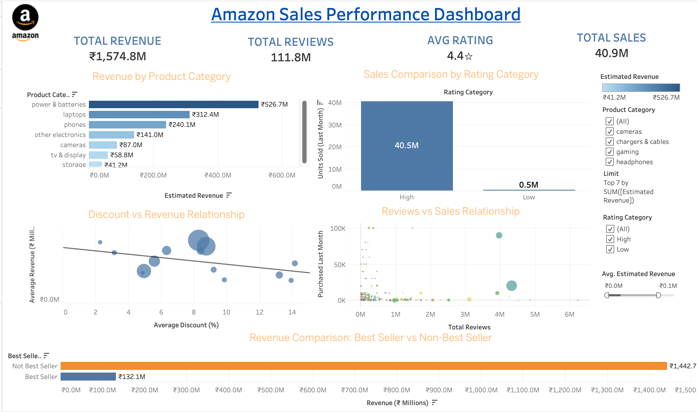

#  Amazon Sales Analysis Dashboard

This project analyzes Amazon product sales data to uncover meaningful insights about revenue trends, customer behavior, and product performance. The goal is to transform raw data into actionable business insights using advanced data analysis and visualization techniques.

---

##  Table of Contents
*   [Project Overview](#-project-overview)
*   [Dataset Description](#-dataset-description)
*   [Technologies Used](#️-technologies-used)
*   [Project Structure](#-project-structure)
*   [Tableau Dashboard](#-tableau-dashboard)
*   [Key Insights](#-key-insights)
*   [Business Recommendations](#-business-recommendations)
*   [How to Run](#️-how-to-run-the-project)
*   [Team Members](#-team-members--contributions)

---

##  Project Overview
The project covers the entire data lifecycle:
*   **Data Extraction:** Gathering raw Amazon sales data.
*   **Cleaning & Preprocessing:** Handling missing values and outliers.
*   **Exploratory Data Analysis (EDA):** Identifying patterns and correlations.
*   **Statistical Analysis:** Validating insights with data-driven metrics.
*   **Visualization:** Creating an interactive dashboard in Tableau.

---

##  Dataset Description
**Dataset:** Amazon Product Sales Dataset (42K+ records)

###  Features
*   **Product Category:** Segmented by niche.
*   **Pricing:** Discounted Price & Original Price.
*   **Engagement:** Product Rating & Total Reviews.
*   **Performance:** Purchased Last Month & Best Seller Indicator.

###  Data Processing
*   Removed duplicates and handled missing values.
*   Converted data types for precise numerical analysis.
*   **New Features Engineered:**
    *   `Estimated Revenue`: Calculated from sales and price.
    *   `Rating Category`: Classified into (High / Low).
    *   `Best Seller Clean`: Boolean flag for high-performing items.

---

##  Technologies Used
*   **Language:** Python (Pandas, NumPy, Matplotlib, SciPy)
*   **Visualization:** Tableau Public
*   **Version Control:** Git & GitHub

---

##  Project Structure
```text
AmazonSalesAnalysis/
├── data/
│   ├── raw/                 # Original dataset
│   └── processed/           # Cleaned data for analysis
├── docs/
│   ├── data_dictionary.md   # Feature definitions
│   └── recommendations.md    # Detailed business logic
├── notebooks/
│   ├── 01_extraction.ipynb
│   ├── 02_cleaning.ipynb
│   ├── 03_eda.ipynb
│   ├── 04_statistical_analysis.ipynb
│   └── 05_final_load_prep.ipynb
├── reports/                 # Project documentation & presentations
│   ├── presentation.md      # Presentation slides
│   └── project.md           # Full project report
├── scripts/
│   └── etl_pipeline.py      # Automated data processing
├── tableau/
│   ├── screenshots/         # Dashboard previews
│   └── dashboard_links.md   # Links to live dashboard
├── requirements.txt         # Dependencies
└── README.md
```

---

##  Tableau Dashboard


🔗 **Direct Link:** [**View Interactive Dashboard on Tableau Public**](https://public.tableau.com/views/Amazon_Dashboard1/Dashboard1?:language=en-US&:sid=&:redirect=auth&:display_count=n&:origin=viz_share_link)

### Key Features:
*   **KPI Cards:** Real-time tracking of Revenue, Sales, Ratings, and Reviews.
*   **Visual Analysis:** Revenue by Category, Discount vs Revenue, and Rating impact.
*   **Interactive Filters:** Drill down by Category and Rating Tier.

---

##  Key Insights
*   **Quality Matters:** High-rated products contribute significantly more to total sales.
*   **Discount Paradox:** Discounts do not always result in higher revenue, indicating diminishing returns.
*   **Volume over Fame:** Non-best seller products generate a larger portion of total revenue due to sheer variety.
*   **Category Leaders:** Certain product categories dominate overall sales performance.
*   **Review Impact:** Reviews show limited correlation with sales, suggesting other influencing factors like pricing.

---

##  Business Recommendations
1.  **Quality Focus:** Prioritize product quality to naturally boost ratings and sales.
2.  **Strategic Pricing:** Apply discounts selectively to avoid margin erosion.
3.  **Inventory Optimization:** Invest more in high-performing product categories.
4.  **Brand Building:** Strengthen marketing for "Best Seller" conversions.
5.  **Multi-channel Strategy:** Combine review management with pricing strategies for holistic growth.

---

##  How to Run the Project
```bash
# Clone the repository
git clone <your-repo-link>

# Navigate to directory
cd AmazonSalesAnalysis

# Install dependencies
pip install -r requirements.txt
```
*Run notebooks sequentially from the `/notebooks` folder.*

---

##  Notes
*   Cleaned dataset is used for all analysis.
*   Dashboard is interactive and designed for C-level decision-making.
*   No hard-coded values; metrics are calculated dynamically.

---

##  Project Status
- [x] Data Cleaning Completed
- [x] Analysis Completed
- [x] Dashboard Published on Tableau Public
- [x] Documentation Completed

---

##  Team Members & Contributions
| Member | Primary Responsibilities |
| :--- | :--- |
| **Vipul Yadav** | Data Cleaning, Preprocessing, Feature Engineering, Dashboard Publishing. |
| **Ananya Gupta** | Dashboard Design, KPI Creation, Visualization Development. |
| **Yashveer Singh** | Data Insights, Statistical Findings, Business Recommendations. |
| **Abhay Pratap Yadav** | Final Project Report, Analysis Documentation, Quality Assurance. |
| **Yash Kishor Mali** | Repository Organization, Project Structure, README Documentation, Data Cleaning. |

---